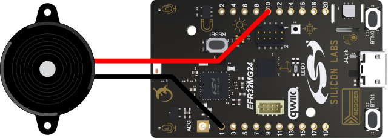
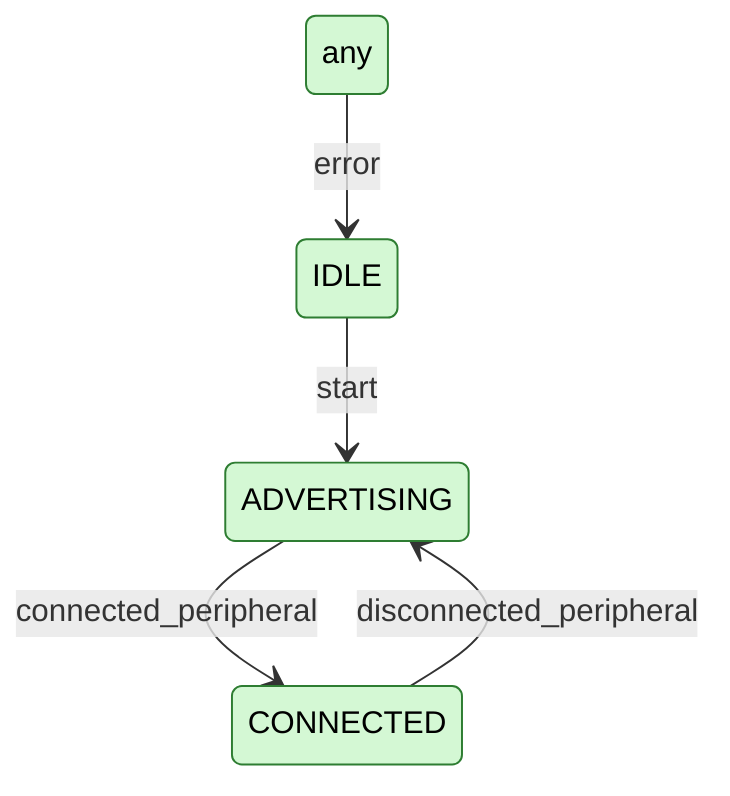
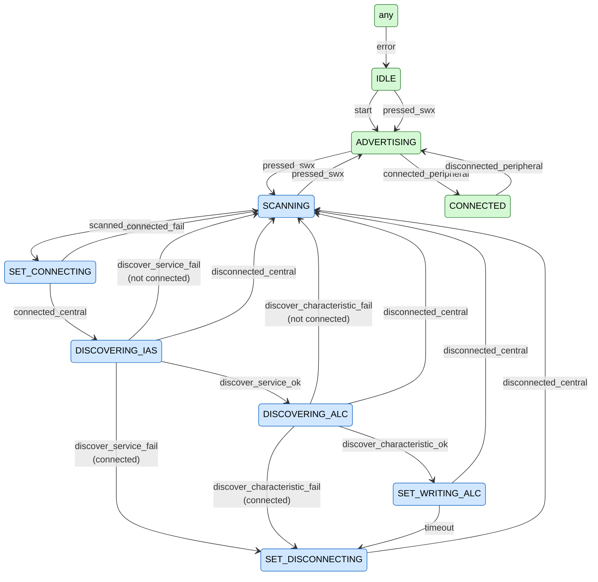
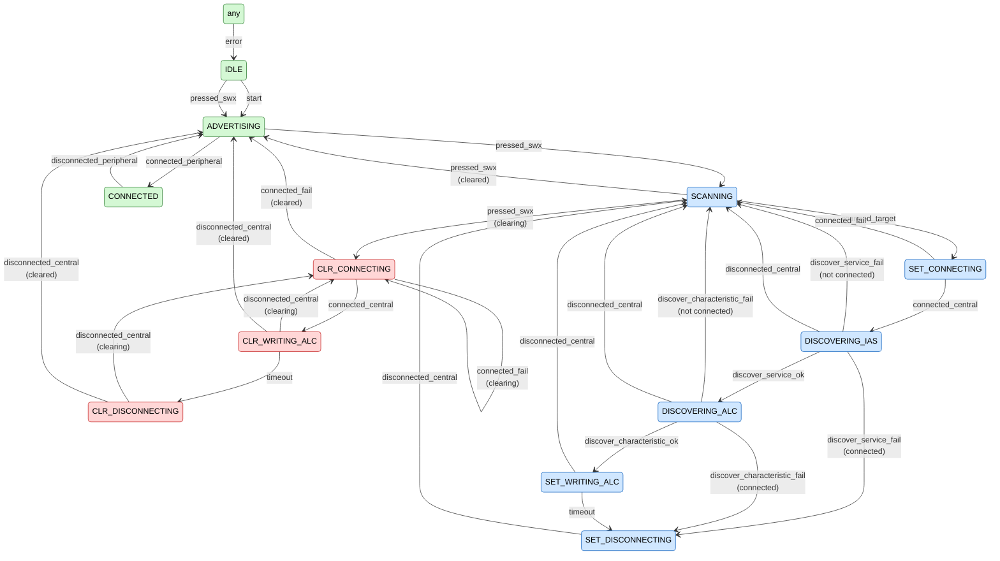

# Dev Lab: Zephyr Bluetooth Find Me

## About

This folder accompanies a series of six Dev Lab videos that provide a practical, step-by-step introduction to developing Bluetooth LE applications using [Zephyr](https://www.zephyrproject.org/) on Silicon Labs low-power wireless microcontrollers. The first video is available on [YouTube](https://youtu.be/Kt_tzDwJqrE), with links to other videos being added in the video description as they are released.

In this series we build a Bluetooth LE key finder application based on the [Bluetooth SIG](https://www.bluetooth.com/) [Find Me Profile](https://www.bluetooth.com/specifications/specs/find-me-profile-1-0/) specification.

## Features

The application operates in two modes:

* In Target Mode alerts can be set from the Simplicity Connect mobile application:
  * When there is no alert the RGB flashes blue and the piezo buzzer is silent
  * When in an alert state the RGB flashes red for a high alert level and green for a mild alert level
  * A piezo buzzer beeps a high note for the high alert level and a low note for the mild alert level
  * Pressing either button cancels any alert
* Pressing a button when no alert is raised switches to Locator Mode:
  * The application then scans for devices operating in Target Mode, connects to them, discovers Bluetooth services and characteristics, then writes the alert level
  * When button 0 is pressed found devices are placed in mild alert and button 1 applies high alerts
  * While in Locator Mode the RGB rapidly flashes green when setting mild alerts and red when setting high alerts
  * From Locator Mode any button can be pressed to first clear any set alerts in Target devices, then return to Target Mode
  * While alerts are being cleared the blue LED flashes rapidly
* The application achieves over 1 year of battery life when operating from a CR2032 coin cell in Target Mode, with the blue LED flashing disabled

## Hardware

The application is developed on the Silicon Labs [EFR32xG24 Dev Kit (xG24-DK2601B)](https://www.silabs.com/development-tools/wireless/efr32xg24-dev-kit). The application makes use of the on-board RGB LED and two user buttons, plus an added passive piezo buzzer. The coin cell slot on the rear allows battery operation from a CR2032 battery.

 

Zephyr allows easy movement to other boards. If your board has fewer buttons or LEDs you may choose to either add additional external hardware or reduce the number of buttons or LEDs used by the application, possibly by supporting only one alert level instead of two.

## Software

You will need to have a Zephyr installation to follow these Dev Labs, Silicon Labs releases Zephyr in two ways, you can use either to work with this code, in the videos we use the upstream release:

1. Upstream release, this is the main set of Zephyr files available from the Zephyr Project. To install this release follow the [Getting Started Guide](https://docs.zephyrproject.org/latest/develop/getting_started/index.html) on the Zephyr Project's website. This release currently supports more Silicon Labs boards than the downstream release.
2. Downstream release, is a customized distribution optimized for Silicon Labs Wireless Systems-on-Chips (SoCs). It builds on upstream Zephyr but is subject to full Silicon Labs QA and is supported through Silicon Labs usual support channels. You can learn more about this release in our [blog post](https://www.silabs.com/blog/introducing-silicon-labs-simplicity-sdk-for-zephyr-rtos). To install the downstream release follow the [Getting Started with Simplicity SDK for Zephyr documentation](https://docs.silabs.com/zephyr/latest/zephyr-getting-started).

The Dev Lab is divided into six main steps, each having its own video. Some steps are further divided into sub-steps. Each step or sub-step has its own folder in this repository with each folder having files for a complete application. In addition to code walkthroughs in the videos you can use a difference tool to examine the code changes between each step or sub-step. An overview of each step is given below.

### Step 1: Device Information Service

The video for this step can be found on [YouTube](https://youtu.be/Kt_tzDwJqrE).

In this step we explore the [Device Information Service sample application](https://docs.zephyrproject.org/latest/samples/bluetooth/peripheral_dis/README.html#ble_peripheral_dis), provided in the Zephyr installation, to use as a starting point for our application as it operates as a Bluetooth peripheral, allowing connections and also the commonly used Device Information Service which contains hardware and software identification and version information.

We then adapt the application to reduce the number of characteristics in the service, allow reconnections after a disconnection, and introduce an application state machine to build on later. The source code for this adapted version can be found in the `step_1_dis` folder of this repository.

**State Transition Diagram**

### Step 2: Input and Output

This step adds support to the application for the buttons, LEDs and piezo buzzer which will be used in the Find Me application.

**Step 2a: Inputs**

Enables the buttons using Zephyr's [Input APIs](https://docs.zephyrproject.org/latest/services/input/index.html), at this stage the button presses are simply output as debug messages, these files are in the `step_2a_inputs` folder.

**Step 2b: LEDs**

Enables the RGB LED using Zephyr's [LED APIs](https://docs.zephyrproject.org/latest/hardware/peripherals/led.html), the LEDs are used to indicate the application's state, source code is in the `step_2b_leds` folder.

**Step 2c: Piezo**

Enables the sounding of notes on the piezo buzzer using [PWM APIs](https://docs.zephyrproject.org/latest/hardware/peripherals/pwm.html), the low energy timer is used to generate the signal so it can continue to sound when the application is placed into sleep states in the final step. We make additions to the application's Device Tree configuration to achieve this. The piezo beeps when the application is in the CONNECTED state to show it is working. Code can be found in the `step_2c_piezo` folder.

**Step 2d: LEDs**

When enabling PWM for the piezo buzzer the LEDs stop working with the GPIO outputs we used previously, due to PWM drivers for the pins overriding their use with GPIO. In this final sub-step we further alter the Device Tree to remove PWM use for the RGB pins to restore operation using GPIO.

### Step 3: Find Me Target Mode

This step adds support for for the [Find Me Profile's](https://www.bluetooth.com/specifications/specs/find-me-profile-1-0/) Target Mode which is the mode in which the device can be triggered to sound alerts remotely to allow it to be found.

The [Immediate Alert service](https://www.bluetooth.com/specifications/specs/immediate-alert-service-1-0/) along with its Alert Level characteristic is set up in the device including a callback function when the characteristic is written to. The LED and piezo outputs are used to indicate the set alert level as shown in the table below. Pressing either button will return the device to the no alert level.

**LED Indications**

| Alert Level                    | RGB LED              | Piezo              |
| ------------------------------ | -------------------- | ------------------ |
| Target None                    | Blue, slow blinking  | Silent             |
| Target Mild                    | Green, slow blinking | Low, slow beeping  |
| Target High                    | Red, slow blinking   | High, slow beeping |
| IDLE/error (application state) | White                | Silent             |

At this stage alerts can be triggered using the [Simplicity Connect](https://www.silabs.com/software-and-tools/simplicity-connect-mobile-app) mobile application.

### Step 4: Find Me Locator Mode

This step adds support for the [Find Me Profile's](https://www.bluetooth.com/specifications/specs/find-me-profile-1-0/) Locator Mode which is the mode that can trigger alerts in other devices that are in Target Mode to allow them to be found.

The state machine is expanded to work through the following stages in order to raise alerts on remote devices when a button is pressed and there is currently no target alert set, errors are handled gracefully. The addresses of devices that have been successfully connected to are stored, those addresses are ignored in later scans to avoid reconnecting to a device that already has an alert triggered or where discovery has failed.

1. Scan for devices advertising the Immediate Alert service and a matching Device Name
2. Connect to a found device
3. Discover the Immediate Alert service
4. Discover the Alert Level characteristic
5. Write mild alert when button 0 was pressed to swap to Locator Mode, write high alert when button 1 was used
6. Disconnect
7. Resume scanning
8. Pressing either button will return to Target Mode.

**State Transition Diagram**

New states are blue.

**Button Functions**

Changes are in italics.

| Alert Level         | Button Press | Action                            |
| ------------------- | ------------ | --------------------------------- |
| Target Mild/High    | Any          | Go to Target None alert level     |
| *Target None*       | *0*          | *Go to Locator Mild alert level*  |
| *Target None*       | *1*          | *Got to Locator High alert level* |
| *Locator Mild/High* | *Any*        | *Go to Target None alert level*   |

**LED Indications**

Changes are in italics

| Alert Level                    | RGB LED                | Piezo              |
| ------------------------------ | ---------------------- | ------------------ |
| Target None                    | Blue, slow blinking    | Silent             |
| Target Mild                    | Green, slow blinking   | Low, slow beeping  |
| Target High                    | Red, slow blinking     | High, slow beeping |
| *Locator Mild*                 | *Green, fast blinking* | *Silent*           |
| *Locator High*                 | *Red, fast blinking*   | *Silent*           |
| IDLE/error (application state) | White                  | Silent             |

### Step 5: Locator Mode Clear

This step adds clearing of alerts on previously alerted devices when exiting Locator Mode by pressing any button, before returning to Target Mode. This allows alerts to be cleared without needing to press a button on the alerted device, though that will still work.

To do this, the addresses and characteristic handles of any devices written to while in Locator Mode are stored. When clearing, those devices are reconnected to again, without a rescan, and their alert level is set to none, without rediscovery. Three attempts are made to clear each Target device. The device then returns from Locator Mode to Target Mode. The state machine is expanded to introduce these extra steps.

**State Transition Diagram**

New states are red.

**Button Functions**

Changes are in italics.

| Alert Level       | Button Press | Action                                        |
| ----------------- | ------------ | --------------------------------------------- |
| Target Mild/High  | Any          | Go to Target None alert level                 |
| Target None       | 0            | Go to Locator Mild alert level                |
| Target None       | 1            | Got to Locator High alert level               |
| Locator Mild/High | Any          | *Clear alerts, go to Target None alert level* |

**LED Indications**

Changes are in italics

| Alert Level                    | RGB LED               | Piezo              |
| ------------------------------ | --------------------- | ------------------ |
| Target None                    | Blue, slow blinking   | Silent             |
| Target Mild                    | Green, slow blinking  | Low, slow beeping  |
| Target High                    | Red, slow blinking    | High, slow beeping |
| Locator Mild                   | Green, fast blinking  | Silent             |
| Locator High                   | Red, fast blinking    | Silent             |
| *Locator None (clearing)*      | *Blue, fast blinking* | *Silent*           |
| IDLE/error (application state) | White                 | Silent             |

### Step 6: Power Management

This step focuses on reducing power consumption to achieve long battery life on a CR2032 coin cell. Here we enable Zephyr’s power management to get a battery life of over one year from a CR2032 coin cell when at the Target None alert level. All calculations shown below assume the CR2032 has 190 mAh of useable power.

Previous steps took some account of power by only transmitting advertisements approximately every three seconds and using the low energy timer to drive the PWM signal for the piezo buzzer. However the code at the end of Step 5 consumes an average 2.4 mA resulting in a battery life of just 3.3 days.

`190 mAh / 2.4 mA = 79 hours (3.3 days)`

In this step we make use of Zephyr's power management settings and further fine-tune the application code to extend battery life over a few sub-steps and make use of the Energy Profiler in the Simplicity Studio IDE to take measurements as we go.

**Step 6a: Power Manager**

In this first step we enable Zephyr's [Power Management](https://docs.zephyrproject.org/latest/services/pm/index.html) functionality, including tickless mode to allow the MCU to enter a sleep state when idle and thus preserve power and extend battery life. Once enabled average current drops to 120 µA resulting in a battery life of 2.2 months.

`190 mAh / 0.120 mA = 66 days (2.2 months)`

Updated files are in the `step_6a_power` folder.

**Step 6b: Disable Sensors**

The board has a lot of sensors fitted which are automatically enabled in the Device Tree for the board and so consume power. As we are not using these sensors we disable them by editing the application's Device Tree overlay to further reduce power consumption. This results in an average current consumption of 46.4 µA and a battery life of 5.7 months.

`190 mAh / 0.0464 mA = 171 days (5.7 months)`

Updated files are in the `step_6b_sensors` folder.

**Step 6c: Disable LED**

The flashing of the blue LED to indicate the device is at the Target None alert level is not strictly necessary and consumes a fair amount of power, by removing this flashing the battery life can be extended further. In this sub-step the output configuration table in `main.c` is updated to no longer flash the blue LED in this scenario. As the blue LED can be useful when working on the code or for demonstrations a #define can be used to re-enable its use. With the blue LED disabled average current consumption is reduced to 22.8 µA extending the battery life to 11.6 months.

`190 mAh / 0.0228 mA = 347 days (11.6 months)`

Updated files are in the `step_6c_led` folder.

**Step 6d: Suspend Output Work Scheduling**

When examining the energy profile for the previous step two small power spikes can still be seen where the blue LED would be turned on and off. These are due to the delayable work item being activated and processed but they no longer turn the LED on. In this final sub-step the scheduling of the work item is suspended when at the Target None alert level to remove the power spikes and resumed when at other alert levels to allow continued flashing of the LEDs and beeping of the piezo buzzer.

This results in an average current consumption of 19.5 µA and a battery life of 13.5 months.

`190 mAh / 0.0195 mA = 406 days (13.5 months)`

Updated files are in the `step_6d_timer` folder.

## Commands

* `zephyrproject\.venv\Scripts\Activate.ps1` Activate Python virtual environment, from Windows PowerShell home folder
* `west build -b xg24_dk2601b -p always` Full, pristine build for xG24 Dev Kit, from application/step folder
*  `west build` Incremental build for previously built board, from application/step folder

* `west flash` Flash binary to board, from application/step folder

* `.\make_state_machine.ps1 state_machine.md` Create state machine markdown file from code comments in `state_machine` folder, from application/step folder in Windows PowerShell