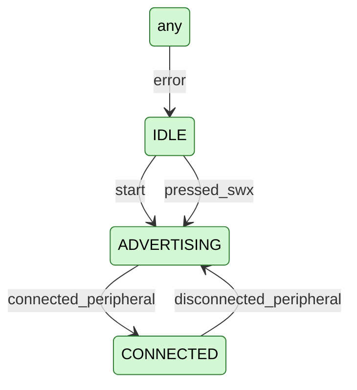

**Find Me (Step 2c: Piezo) - State Transition Diagram**

```mermaid
stateDiagram-v2
IDLE --> ADVERTISING: start
IDLE --> ADVERTISING: pressed_swx
ADVERTISING --> CONNECTED: connected_peripheral
CONNECTED --> ADVERTISING: disconnected_peripheral
any --> IDLE: error
classDef green fill:#d4f8d4,stroke:#2e7d32,color:#000
class IDLE,ADVERTISING,CONNECTED,any green
```
