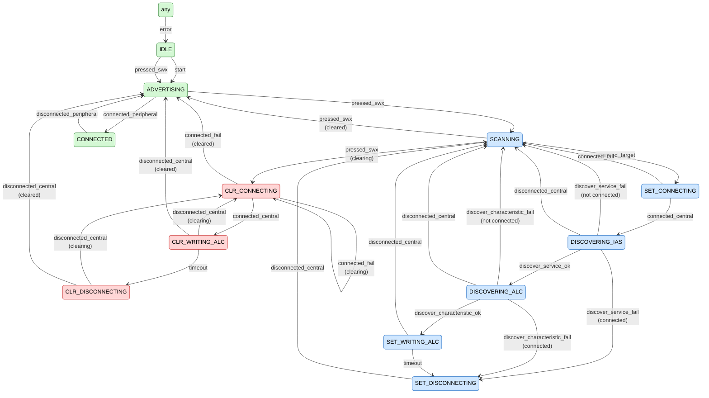

**Find Me (Step 5: Clear) - State Transition Diagram**

```mermaid
stateDiagram-v2
IDLE --> ADVERTISING: start
IDLE --> ADVERTISING: pressed_swx
ADVERTISING --> SCANNING: pressed_swx
ADVERTISING --> CONNECTED: connected_peripheral
CONNECTED --> ADVERTISING: disconnected_peripheral
SCANNING --> CLR_CONNECTING: pressed_swx<br>(clearing)
CLR_CONNECTING --> CLR_CONNECTING: connected_fail<br>(clearing)
CLR_WRITING_ALC --> CLR_CONNECTING: disconnected_central<br>(clearing)
CLR_DISCONNECTING --> CLR_CONNECTING: disconnected_central<br>(clearing)
SCANNING --> ADVERTISING: pressed_swx<br>(cleared)
CLR_CONNECTING --> ADVERTISING: connected_fail<br>(cleared)
CLR_WRITING_ALC --> ADVERTISING: disconnected_central<br>(cleared)
CLR_DISCONNECTING --> ADVERTISING: disconnected_central<br>(cleared)
SCANNING --> SET_CONNECTING: scanned_target
SET_CONNECTING --> SCANNING: connected_fail
SET_CONNECTING --> DISCOVERING_IAS: connected_central
DISCOVERING_IAS --> SET_DISCONNECTING: discover_service_fail<br>(connected)
DISCOVERING_IAS --> SCANNING: discover_service_fail<br>(not connected)
DISCOVERING_IAS --> DISCOVERING_ALC: discover_service_ok
DISCOVERING_IAS --> SCANNING: disconnected_central
DISCOVERING_ALC --> SET_DISCONNECTING: discover_characteristic_fail<br>(connected)
DISCOVERING_ALC --> SCANNING: discover_characteristic_fail<br>(not connected)
DISCOVERING_ALC --> SET_WRITING_ALC: discover_characteristic_ok
DISCOVERING_ALC --> SCANNING: disconnected_central
SET_WRITING_ALC --> SET_DISCONNECTING: timeout
SET_WRITING_ALC --> SCANNING: disconnected_central
SET_DISCONNECTING --> SCANNING: disconnected_central
CLR_CONNECTING --> CLR_WRITING_ALC: connected_central
CLR_WRITING_ALC --> CLR_DISCONNECTING: timeout
any --> IDLE: error
classDef green fill:#d4f8d4,stroke:#2e7d32,color:#000
classDef blue fill:#d0e7ff,stroke:#1565c0,color:#000
classDef red fill:#ffd6d6,stroke:#c62828,color:#000
class IDLE,ADVERTISING,CONNECTED,any green
class SCANNING,SET_CONNECTING,DISCOVERING_IAS,DISCOVERING_ALC,SET_WRITING_ALC,SET_DISCONNECTING blue
class CLR_CONNECTING,CLR_WRITING_ALC,CLR_DISCONNECTING red
```
